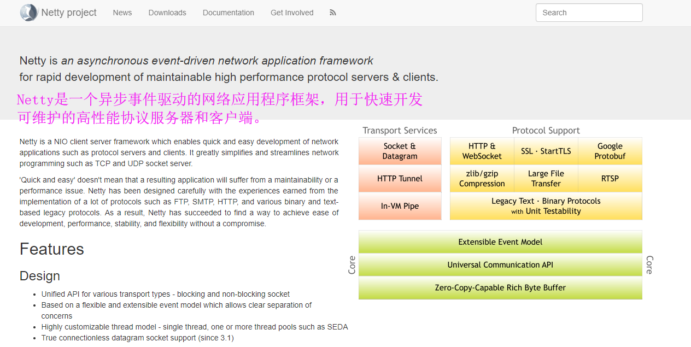

# Netty介绍

1. Netty是由Jboss提供的一个java开源框架，是业界最流行的NIO框架，整合了多种协议（包括FTP、SMTP、HTTP等）的实现经验，精心设计的框架，在多个大型商业项目中得到充分验证。

2. 哪些主流框架在用？

   1）搜索引擎框架ElasticSearch

   2）Hadoop子项目Avro项目

   3）RPC框架Dubbo
   
3. 官网https://netty.io

   
   
   

