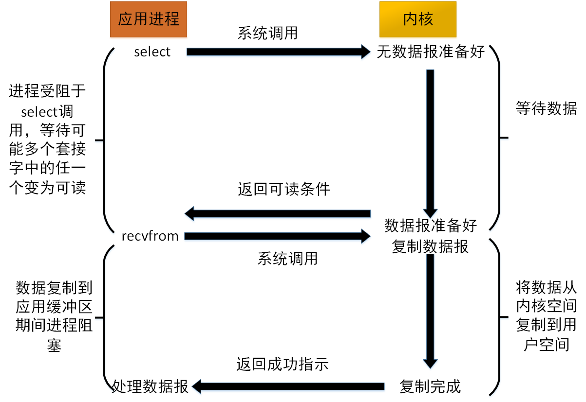

# 五种IO模型介绍

### 阻塞式I/O

### 非阻塞式I/O

### I/O复用

### 信号驱动式I/O

### 异步I/O

### 五种I/O模型的对比

# Java的I/O演进历史

- jdk1.4之前是采用同步阻塞模型，也就是BIO 大型服务一般采用C或者C++, 因为可以直接操作系统提供的异步
  IO,AIO
- jdk1.4推出NIO,支持非阻塞IO，jdk1.7升级,推出NIO2.0,提供AIO的功能，支持**网络套接字socket**的异步IO

# Netty线程模型和Reactor模式

# Netty的helloworld项目：Echo项目

可以用传统的bio写个项目和这个echo项目去做个压测，传统的bio可能几千就挂了，而echo随便都可以上万级

